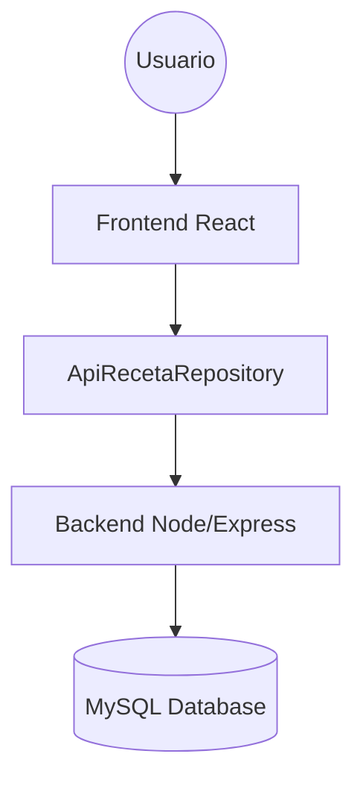

# 🍳 Recetario Full Stack - Arquitectura Hexagonal

Una aplicación completa de gestión de recetas (CRUD) diseñada para demostrar los principios de la **Arquitectura Hexagonal** (Ports & Adapters). Este proyecto desacopla totalmente la lógica de negocio (Dominio) de la interfaz de usuario (React) y los servicios externos (API/Base de Datos).

## 🧠 Concepto: Arquitectura Hexagonal

El objetivo principal de este proyecto no es solo guardar recetas, sino demostrar cómo estructurar software escalable y mantenible. La aplicación está dividida en tres capas estrictas:

1.  **🟢 Dominio (Core):** Define qué es una `Receta` y las reglas de negocio. No sabe que existe React ni MySQL.
2.  **🔌 Infraestructura:** Implementa los adaptadores (`ApiRecetaRepository`) que conectan el dominio con el mundo exterior.
3.  **🎨 UI (Interfaz):** Componentes visuales que solo consumen la lógica del dominio a través de interfaces.

### 🗺️ Flujo de Datos



## 🛠️ Tecnologías Utilizadas

**Frontend:**
* React + Vite
* TypeScript (Interfaces, Generics, Utility Types)
* CSS Moderno (Variables, Animaciones, Diseño de Tarjetas)

**Backend:**
* Node.js
* Express (Router modular)
* CORS

**Base de Datos:**
* MySQL (Relacional + JSON Data Type)

---

## 🚀 Instalación y Configuración

Sigue estos pasos para levantar el entorno completo.

### 1. Base de Datos (MySQL) 🗄️

Ejecuta el siguiente script en tu gestor de base de datos (Workbench/HeidiSQL) para crear la estructura inicial:

```sql
CREATE DATABASE IF NOT EXISTS recetario_hexagonal;
USE recetario_hexagonal;

CREATE TABLE recetas (
    id INT AUTO_INCREMENT PRIMARY KEY,
    titulo VARCHAR(255) NOT NULL,
    categoria ENUM('desayuno', 'almuerzo', 'cena', 'postre') NOT NULL,
    ingredientes JSON NOT NULL,
    preparacion TEXT NOT NULL,
    imagen VARCHAR(500)
);

-- Datos semilla opcionales
INSERT INTO recetas (titulo, categoria, ingredientes, preparacion, imagen) VALUES 
('Avena SQL', 'desayuno', '["Avena", "Leche"]', 'Mezclar todo.', '[https://via.placeholder.com/150](https://via.placeholder.com/150)');
```

### 2. Backend (Servidor) 🖥️

1. Navega a la carpeta del servidor:
   ```bash
   cd Backend_Recetas
   ```
2. Instala las dependencias:
   ```bash
   npm install
   ```
3. Configura tu conexión en `db_connection.js` con tu contraseña de MySQL.
4. Inicia el servidor:
   ```bash
   node index.js
   ```
   *Debe aparecer: `🚀 Servidor corriendo...`*

### 3. Frontend (Cliente) 🎨

1. Navega a la carpeta del proyecto React:
   ```bash
   cd RecetarioHexagonal
   ```
2. Instala las dependencias:
   ```bash
   npm install
   ```
3. Inicia el servidor de desarrollo:
   ```bash
   npm run dev
   ```

---

## 📂 Estructura del Proyecto

La magia ocurre en la carpeta `src/`, organizada por responsabilidades:

```
src/
├── core/                  <-- EL HEXÁGONO (Lógica Pura)
│   └── domain/
│       ├── Receta.ts            # Definición de Tipos y Entidades
│       └── RecetaRepository.ts  # Contrato (Interface)
│
├── infrastructure/        <-- EL MUNDO EXTERIOR
│   ├── api/                     # Adaptador para conectar con Backend Real
│   └── local/                   # Adaptador para pruebas locales (Mock)
│
└── ui/                    <-- REACT (Vista)
    ├── components/              # Tarjetas, Formularios
    ├── pages/                   # Lógica de Vistas (Hooks)
    └── App.tsx
```

## 📡 Documentación de la API

El Backend expone los siguientes Endpoints RESTful:

| Método | Endpoint | Descripción |
| :--- | :--- | :--- |
| `GET` | `/api/recetas/:categoria` | Obtiene una receta aleatoria por categoría |
| `POST` | `/api/recetas` | Crea una nueva receta |
| `PUT` | `/api/recetas/:id` | Actualiza una receta existente |
| `DELETE` | `/api/recetas/:id` | Elimina una receta por ID |

---

## ✨ Características Destacadas

* **Tipado Estricto:** Uso de TypeScript para prevenir errores en tiempo de compilación.
* **Adaptabilidad:** Capacidad de cambiar entre un repositorio Local y una API Remota cambiando una sola línea de código en el Frontend (Patrón Strategy/Adapter).
* **Componentes Reutilizables:** Uso del mismo formulario (`FormularioReceta`) tanto para Crear como para Editar, gestionando el estado de forma inteligente.
* **Diseño Moderno:** Interfaz limpia con sombras suaves, bordes redondeados y feedback visual al usuario.

---

### Autor
Cristian Camilo González Blanco
Desarrollado como proyecto de consolidación Full Stack.